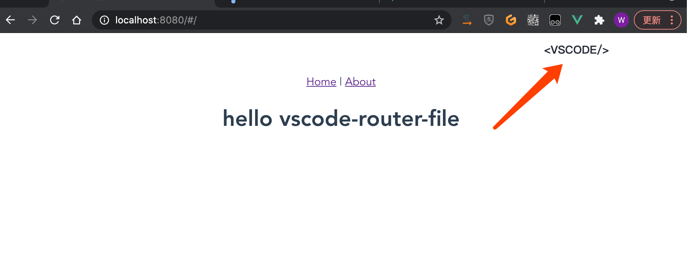

## vscode-router-file 是什么？

它是一个vue插件，我们可以在浏览器里通过 `双击` 的形式去唤起vscode打开当前路由源文件。

示例：[https://github.com/lisiyizu/vscode-router-file-example](https://github.com/lisiyizu/vscode-router-file-example)

## vscode-router-file 使用教程

第一步，安装一个webpack小插件： yarn add virtual-module-cwd

```javascript
// webpack.config.js 方式
const virtualModuleCwd = require("virtual-module-cwd");
webpack: {
  plugins: [virtualModuleCwd],
}
 
// vue.config.js 方式
const virtualModuleCwd = require("virtual-module-cwd");
module.exports = {
    configureWebpack: config => {
        config.plugins.push(virtualModuleCwd);
    }
};
```

第二步， 安装  yarn add @kummy/vscode-router-file
```javascript
import vscodeRouterFile from "@kummy/vscode-router-file";

if(process.env.NODE_ENV === 'development') {
	Vue.use(vscodeRouterFile)
}	

// Vue.use(vscodeRouterFile, {
// 	style: {}, // 样式覆盖
//  innerHTML: "<div>&lt;VSCODE/&gt;</div>" // html 内容覆盖
// });
```

如果完成以上👆步骤，出现下图👇所示，证明可以使用了。



可以勾选 “始终允许···”

